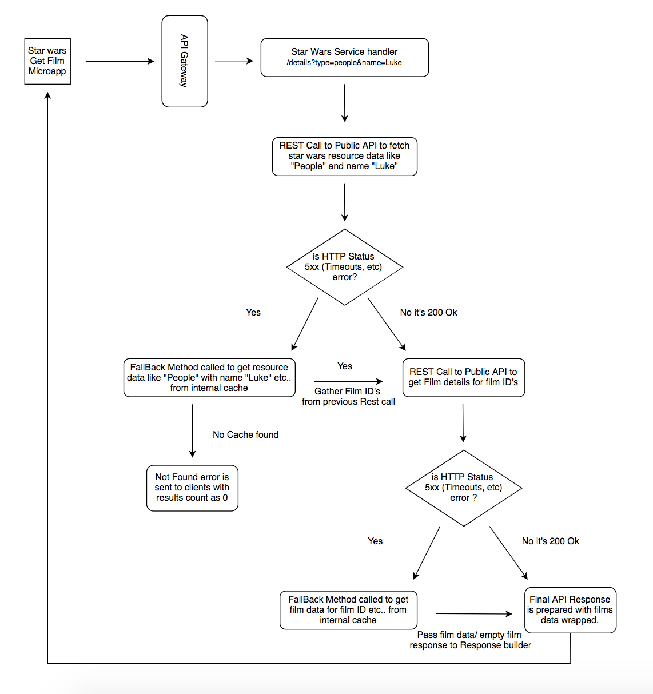

### Star Wars API Service

* A Microservice to find details of Planets, starships, Vehicles, People, Films and Species from star wars Public API
* Star Wars details API can be used to find details of a star wars films by filtering/ searching with resource type (Planets, Spaceships, Vehicles, People, Films and Species) and name of resource

###### Note: 
   The film data will have hyperlinks (path) with other resources like People, starships, vehicles etc from the same film. 
   The same hyperlink (path) can be used by the API consumer/ client app to find the data of the respective resources. 

#### System Design




#### Assumptions

* The /details API is to fetch the list of film data by filtering with resource types (Planets, starships, Vehicles, People, Films and Species) and name of the resource
* The circuit breaker's fallback methods are getting a data from internal application cache. 
* API Gateways like Apigee/ kong will take care of Authentication and Authorization with Multiple user/ app tokens for securing the Rest API calls from consumer/ client apps.
* Helm chart has been added assuming the deployment of the starwars Applications will be orchestrated in kubernetes. 
* Assuming the Jenkinsfile is a mock with multiple stages in the pipeline. This Pipeline will work with modifications and the Jenkins setup

#### Improvements

* The circuit breaker's fallback methods can be improved to get cached data from a distributed cache like Redis Cache db, just for simplicity internal Hash Map is used in the current implementation.
* Each hyperlinks (path) for the resources like People, starships, vehicles etc.. from film detail/ object can have a seperate (REST) API endpoint to get the specific resource details.
* Means new REST controllers can be created for each resources like People, starships, vehicles etc to fetch details by resource ID (Resource ID) will be available from film data object

#### Available API and its usages

###### Health Check API

This API used to check whether the star wars API server running and its status

```
http://localhost:8080/starwars/version
```

######  Star wars API

This API used to get the updated/ latest details of Planets, Spaceships, Vehicles, People, Films and Species for the given start wars movies. 

Request Skeleton
```
http://localhost:8080/starwars/details?type={{entityType}}&name={{entityName}}
```

Example
```
http://localhost:8080/starwars/details?type=Vehicles&name=Sand Crawler
```

##### Tech Stacks used

* Spring boot
* Java 11
* Netflix Hystrix - Used for Circuit Breaker and Fault Tolerance (This makes sure the API works from offline mode, even if the dependent Public Api is not reachable.)
* Junit & Mockito used for integration test and unit test cases
* Docker - for containerizing the application
* Helm Charts - Ease of maintenance to deployments, revisions, rollbacks and orchestration to kubernetes.
* Jenkins Pipeline - CI/ CD with scripts to mvn test, docker build, docker push, helm deploy (Assuming the jenkinsfile is a mock with many best practises and stages to follow)

Helm can be used for managing the deployments and manifest files while orchestrating the app in Kubernetes

##### Design and Implementations

* The StarWars Service integrated with Public API - SWAPI to fetch details about star wars films with resource type and name. (Rest Calls)
* Circuit breaker pattern is implemented in the design for fault tolerance to make the API work even though the Public API server facing a down-time/ timeout issues.
* Builder design pattern for DTO/ Response Object creation
* Single ton design pattern provided by spring for Service/ Helper class Object creation

##### Test cases

The project is covered with integration tests and unit tests and which can be included in the CI/ CD pipelines to automate as a regression tests.

```
mvn clean test
```

##### Docker build and Deploy

```
docker build -f docker/Dockerfile -t star-wars-service:latest .
docker run -d -p 8080:8080 star-wars-service:latest
```

##### Helm

Helm can be used for managing the deployments and manifest files while orchestrating the app in Kubernetes.
Please find my base helm config here. (https://github.com/sundargsv/infrastructure-as-code/tree/main/nonprod-k8s/helm-sample)
